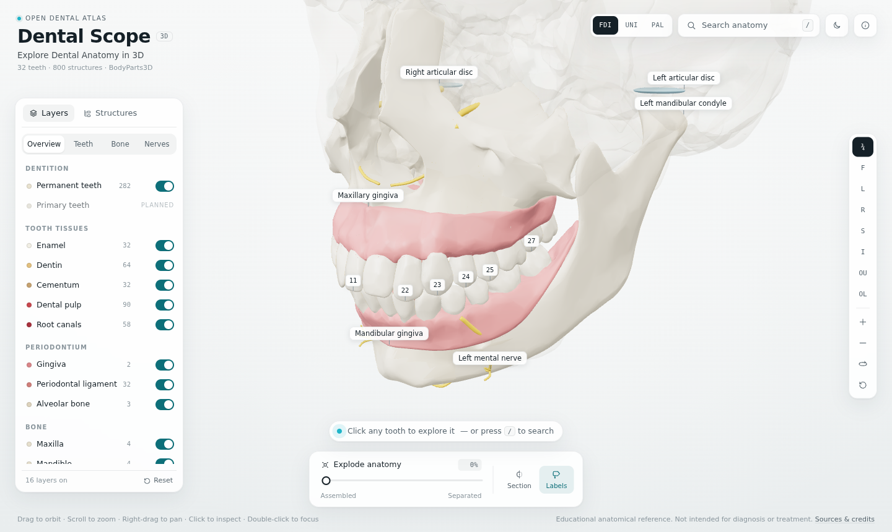
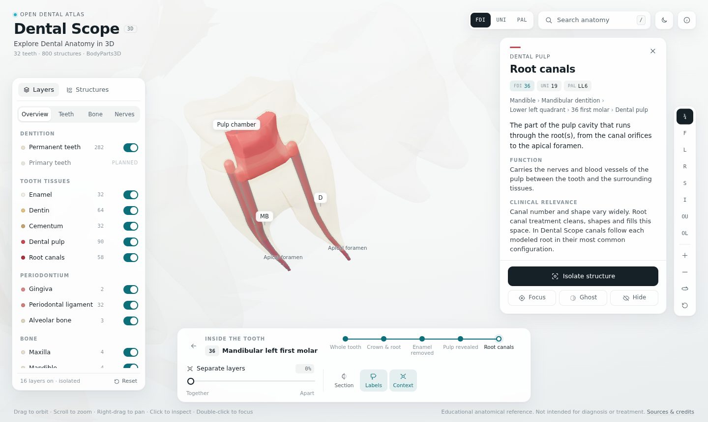
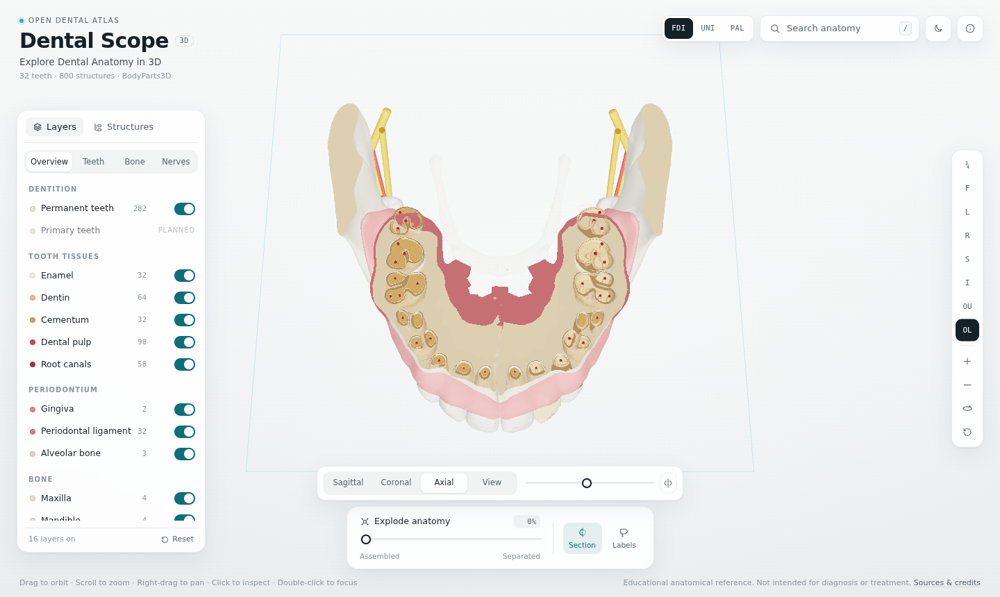
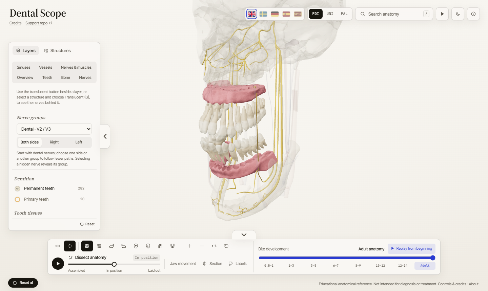
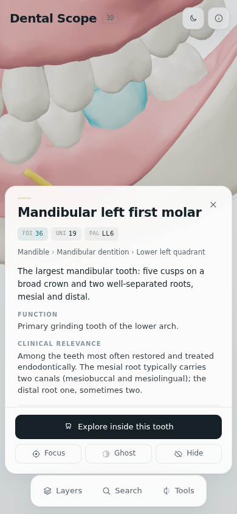

# Dental Scope

**Explore Dental Anatomy in 3D.**

Dental Scope is an open-source, interactive 3D dental anatomy explorer. Start with the whole mouth — jaws, gingiva, the complete permanent dentition, nerves and the temporomandibular joints — and move all the way down to the enamel, dentin, pulp chamber and root canals of a single tooth.

> Educational anatomical reference. Not intended for diagnosis or treatment.



| Inside a tooth | Cross-section through the arch | Dissected anatomy |
|---|---|---|
|  |  |  |

<p align="center"></p>

## Features

- **Mouth → jaw → dentition → tooth → tissue.** One continuous scene; no separate "tooth viewer".
- **All 32 permanent teeth**, individually selectable, named anatomically, with **FDI, Universal and Palmer** numbering (switchable).
- **Inside every tooth:** enamel, coronal and radicular dentin, cementum, periodontal ligament, pulp chamber with pulp horns, and one canal per root in its most common configuration (e.g. MB2 in maxillary first molars, two mesial canals in mandibular first molars). Five dissection levels peel the tooth layer by layer.
- **Dissection** at two levels: the whole mouth (*Dissect anatomy*: jaws apart, teeth out of their sockets, nerves and vessels fanned out) and a single tooth (*Separate layers*: enamel shell, dentin, pulp and canals apart).
- **Cross-sections:** sagittal, coronal, axial or view-aligned planes; inside a tooth they switch to mesiodistal, buccolingual and horizontal. Cut surfaces render as solid tissue, so enamel thickness, dentin and pulp read clearly — across all 32 teeth at once.
- **Search** by name, tooth number in any system (`11`, `#8`, `UR6`, `fdi 36`), tissue, synonym (`gums`, `wisdom tooth`, `IAN`, `cuspid`).
- **Layers** for 19 dental categories with show, show-only, translucent and hide; plus hide/ghost/isolate per structure and a full hierarchy tree.
- **Premium camera:** arcing focus transitions, bounding-box framing, eight view presets including occlusal views, optical centre that stays clear of panels.
- **Labels** that anchor to anatomy, declutter by priority, hide when occluded or too small, and select on click.
- **Deep links:** `/tooth/36`, `/tooth/36/dissect`, `/structure/inferior-alveolar-nerve-left`.
- **Honest data:** every structure shows whether it is *source*, *derived*, *modeled* or *schematic* geometry; all text shows its review status.
- **Responsive** (bottom sheets on phones), **keyboard-accessible** (tree view, shortcuts, focus rings), **reduced-motion** aware, light and dark themes.
- **Fast:** ≈0.5 MB of geometry for first paint, the rest streams in; ≈120 KB per tooth's internal anatomy, loaded on demand; render-on-demand loop.

## Tech stack

Vite · React 19 · TypeScript (strict) · Three.js (imperative engine) · Zustand · glTF + meshopt compression.
Asset pipeline: Python (NumPy, SciPy, scikit-image, trimesh) + glTF Transform.

## Getting started

```bash
npm install
npm run dev        # http://localhost:5173
```

```bash
npm test           # notation, registry and search tests
npm run typecheck
npm run build      # static site in dist/ (includes a 404.html SPA fallback)
```

The built site is fully static. For a sub-path deployment set `DS_BASE`, e.g. `DS_BASE=/dental-scope/ npm run build`; with a relative base (`DS_BASE=./`) deep links switch to hash URLs (`#/tooth/36`) so the build works from any folder. Set `VITE_DS_REPO_URL` to link the “Made by Yoseph” credit and the About dialog to the repository; when it is unset the credit is plain text, so a build never advertises a private repository. A GitHub Pages workflow is included; it passes the repository URL only while the repository is public, so re-run it after making the repository public.

### Keyboard

`/` search · `Esc` clear / leave tooth · `F` focus · `I` isolate · `H` hide · `G` ghost · `D` inside tooth · `[` `]` dissection level · `E` dissect anatomy / separate tooth layers · `C` section · `L` labels · arrows orbit · `+` `−` zoom · `R` reset

## Architecture

```
src/
  anatomy/   structure registry, tooth tables, notation     ← anatomy is data
  content/   educational text (JSON) + resolver
  search/    index + scorer
  state/     Zustand store, pure visibility resolver
  engine/    Three.js engine: loading, materials, picking, camera, explode, section, labels
  ui/        React panels (no per-frame rendering)
  modes/     Explore + scaffolds for Learn / Quiz / Compare
tools/pipeline/   BodyParts3D → production GLB
```

- React renders the chrome; the engine owns Three.js and subscribes to the store. Nothing re-renders React per frame.
- One pure function decides every mesh's visibility (categories, hide/ghost, isolation, dissection level, section) and accepts extra filters — the hook for future timeline and procedure modes.
- Loading is staged: jaws & teeth → skull & muscles → nerves & vessels → a tooth's internals on demand.

Details: [docs/architecture.md](docs/architecture.md). Design research: [docs/human-atlas-reference-analysis.md](docs/human-atlas-reference-analysis.md), [docs/dental-data-research.md](docs/dental-data-research.md), [docs/comparison.md](docs/comparison.md).

## Anatomical data and attribution

3D anatomy is derived from **BodyParts3D**, © The Database Center for Life Science, licensed under [CC BY-SA 2.1 Japan](https://creativecommons.org/licenses/by-sa/2.1/jp/deed.en). Third molars, alveolar bone and TMJ regions are derived from it; internal tooth anatomy is modeled inside each real tooth shape; nerves, vessels and joint discs are schematic. See [CREDITS.md](CREDITS.md) and [docs/assets.md](docs/assets.md).

## Roadmap

- [ ] Expert review of all educational text (see [docs/content.md](docs/content.md))
- [ ] Measured nerve and vessel paths (Z-Anatomy, CC BY-SA 4.0; CBCT-derived canals where licences allow)
- [ ] Primary dentition and an eruption timeline (mixed dentition by age)
- [ ] Learn mode: guided lessons as data
- [ ] Quiz mode: identify highlighted structures
- [ ] Compare mode: two teeth side by side
- [ ] Salivary glands, tongue and oral mucosa
- [ ] Procedure modules: caries, restoration, root canal treatment, crown, implant, extraction, orthodontic movement, impaction
- [ ] Anatomical variation (e.g. C-shaped canals, extra roots)
- [ ] Localisation

## Contributing

See [CONTRIBUTING.md](CONTRIBUTING.md). Reviews of the anatomical text by dental professionals are especially welcome.

## Licence

- Code: [MIT](LICENSE)
- 3D models (`public/models/`): CC BY-SA 2.1 JP (derived from BodyParts3D)
- Educational text (`src/content/`): CC BY-SA 4.0
